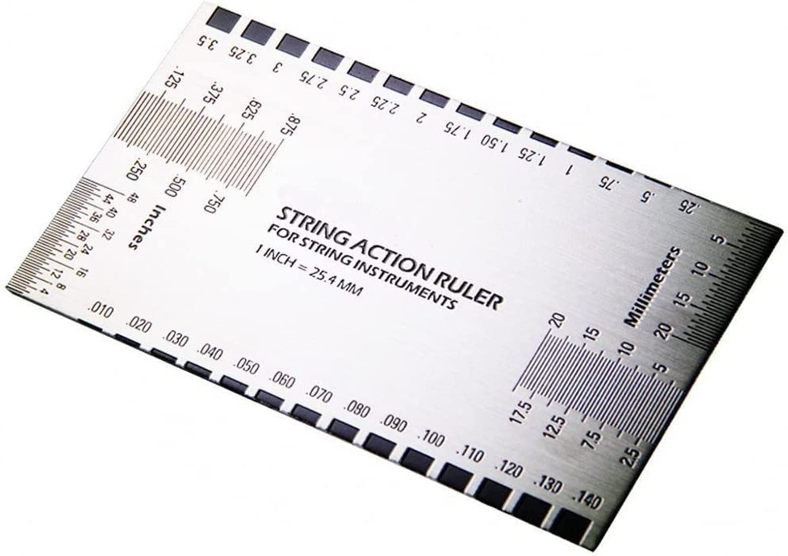

# String Height Optimization for Ibanez Guitars

## TL;DR

You can adjust your string heights above 14th fret using the following table for a balanced feel.

| String        | Height  | Error  |
|---------------|---------|--------|
| 1 (High E)    | 0.06″   | 4.75%  |
| 2             | 1.75mm  | 2.94%  |
| 3             | 0.07″   | 1.22%  |
| 4             | 2mm     | 5.26%  |
| 5             | 2mm     | 0%     |
| 6 (Low E)     | 0.08″   | 3.23%  |
| 7             | 0.09″   | 0.61%  |
| 8             | 2.5mm   | 0%     |

## Problem

[Ibanez provides](maintenance_en.pdf) string height specs only for selected strings (1st, 6th, 7th, 8th).  
The remaining values must be inferred.

Furthermore, in practice, adjustments are limited to:

- 0.25 mm steps (metric gauge)
- 0.01 inch steps (imperial gauge)

So exact target heights usually cannot be set directly.

## Solution

This project estimates missing string heights and finds the closest achievable setup by:

1. Interpolating missing string heights
2. Converting between mm and inches
3. Rounding values to valid gauge steps
4. Comparing both systems using **relative error**
5. Selecting the gauge (mm or inch) with the lowest error

## Key Idea

For each string, we compute:

- mm-based approximation error
- inch-based approximation error

Then choose the system that minimizes:

> relative error = |actual − rounded| / actual

Final error is reported as a percentage.

## Result

The output provides:

- Best gauge system per string (mm or inch)
- Adjusted string height
- Final approximation error (%)

## Why it works

It ensures string setup is:
- physically achievable
- consistent across unit systems
- optimized for minimum deviation from target height